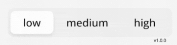

<strong>How to use</strong><br>
```html
<segmented-control
    [options]="options"
    [value]="selectedOption"
    (valueChanged)="selectedOption = $event"
/>
```

<strong>Example inputs</strong><br>
```html
options: SegmentedControlOption[]= [
    {label:"abracadabra", value: 69},
    {label:"simSalomão", value: 420},
    {label:"teste", value: 123}
];
```
  <li> [value]="selectedOption" //the current value </li>
</ul>
