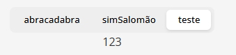

<strong>How to use</strong> 
<segmented-control
    [options]="options"
    [value]="selectedOption"
    (valueChanged)="selectedOption = $event"
/>

<strong>Example inputs</strong> 
<ul>
  <li>
      options: SegmentedControlOption[]= [
      {label:"abracadabra", value: 69},
      {label:"simSalomão", value: 420},
      {label:"teste", value: 123}
    ];
  </li>
  <li> [value]="selectedOption" //the current value </li>
</ul>
